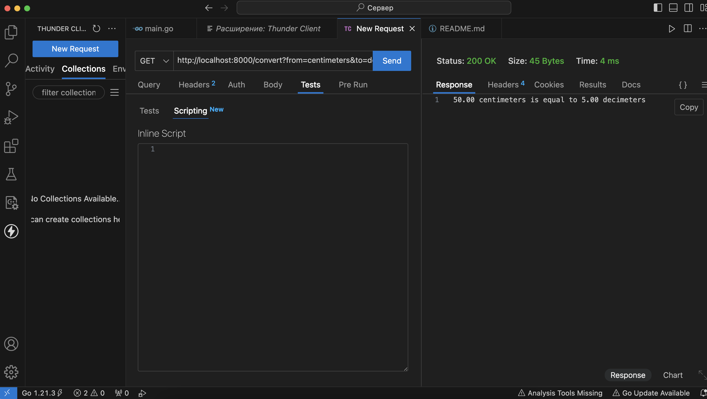
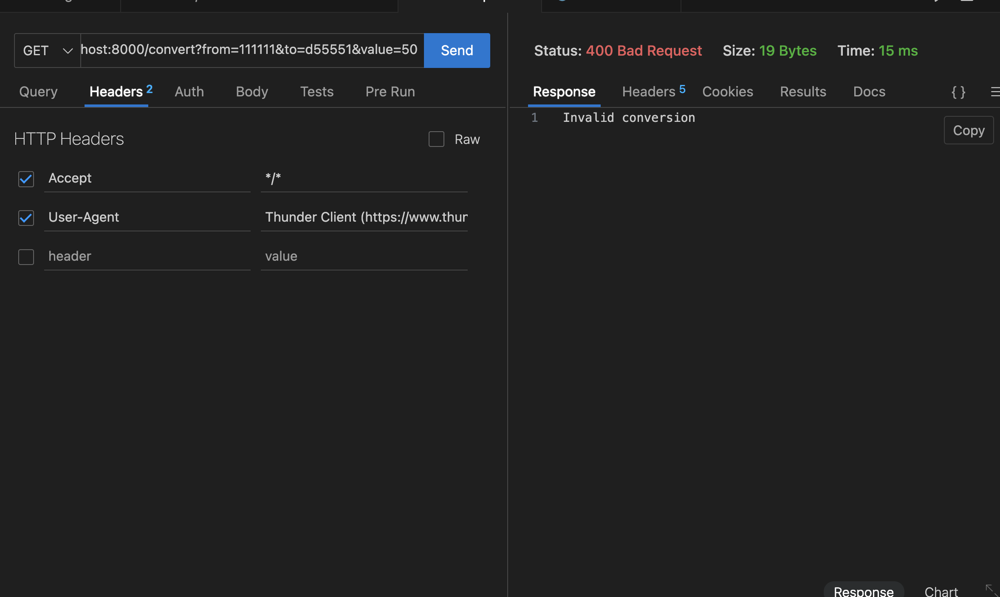

# Конвертер единиц измерения

##### Данный проект представляет собой простой веб-сервер, который предоставляет API для конвертации различных единиц измерения длины: сантиметры, метры и дециметры.

## Использование

Для использования API необходимо отправить GET-запрос на `/convert` с параметрами `from`, `to` и `value`, где:
- `from` - единица измерения, из которой нужно конвертировать (например, "centimeters", "meters" или "decimeters").
- `to` - единица измерения, в которую нужно конвертировать (например, "centimeters", "meters" или "decimeters").
- `value` - числовое значение, которое нужно конвертировать.

| Parameter |    Required |                                     Description |   Type |
|-----------|------------:|----------------------------------------------:|-------:|
|     from  |   Required  | Measurement measure: **`meters`**, **`centimeters`**, **`decimeters`** | string |
|       to  |   Required  | Measurement measure: **`meters`**, **`centimeters`**, **`decimeters`** | string |
|    value  |  Optional   | the number you want to convert from **`"from"`** to **`"to"`**. |  float |

## Примеры запроса:
/convert?from=centimeters&to=meters&value=150

/convert?from=decimeters&to=meters&value=50

## Запуск

Для запуска сервера необходимо выполнить следующую команду:

go run main.go

После этого сервер будет доступен по адресу `http://localhost:8000`

## Примеры ответов

При успешном запросе сервер вернет ответ в формате:
150.00 centimeters is equal to 1.50 meters

В случае ошибки в запросе будет возвращен соответствующий HTTP статус и сообщение об ошибке.

## Тестирование
Если ввести всё правильно

Если допустить ошибку

_____

